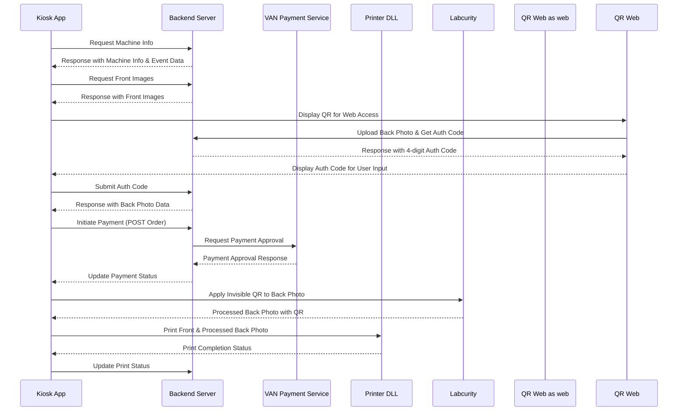

## 📌 **프로젝트 개요 및 기술 스택**


### **프로젝트 개요**

- **이름:** flutter_snaptag_kiosk

- **설명:** 키오스크 기반의 Flutter 프로젝트로, QR 웹과 연동하여 백포토 인쇄 및 결제 시스템을 지원합니다.

- **플랫폼:** Windows (키오스크 전용)


### **기술 스택**


#### 📡 **네트워크 & API 통신**

- `dio` - HTTP 클라이언트

- `retrofit` - REST API 통신 및 요청 모델링

- `http` - 일부 API 호출 (VAN사 결제 처리 시 사용)

- `flutter_dotenv` - 환경 변수 관리 (`.env` 사용)


#### 🔄 **상태 관리**

- `flutter_riverpod` - 전역 상태 관리

- `riverpod_annotation` - 코드 생성 기반의 Riverpod 활용


#### 🌍 **로컬라이제이션**

- `easy_localization` - 다국어 지원 및 번역 관리


#### 🛠️ **라우팅 및 내비게이션**

- `go_router` - 선언형 라우팅 관리

- `go_router_builder` - 코드 생성 기반의 라우팅 설정


#### 🏗 **코드 생성 및 데이터 모델링**

- `freezed_annotation` - 불변 데이터 클래스 및 Sealed 클래스

- `json_annotation` - JSON 직렬화 및 역직렬화

- `build_runner` - 코드 생성 실행

- `freezed` - 코드 생성 기반 데이터 모델 관리

- `json_serializable` - JSON 매핑 자동화

- `retrofit_generator` - Retrofit API 요청 자동 생성

- `riverpod_generator` - Riverpod Provider 자동 생성


#### 🎨 **UI 및 화면 처리**

- `flutter_screenutil` - 반응형 UI 지원

- `loader_overlay` - 로딩 인디케이터 관리

- `qr_flutter` - QR 코드 생성

- `flutter_svg` - SVG 이미지 렌더링


#### 🏗 **파일 및 미디어 처리**

- `file_picker` - 파일 선택 및 업로드

- `image` - 이미지 변환 및 처리

- `flutter_soloud` - 오디오 출력 관리


#### 🔧 **기타 유틸리티**

- `logger` - 로그 출력

- `faker` - 더미 데이터 생성

- `window_manager` - 창 크기 및 UI 동작 관리

- `pretty_dio_logger` - API 요청 로깅


#### 🧪 **테스트 & 개발 도구**

- `flutter_test` - 기본 테스트 프레임워크

- `flutter_lints` - 코드 린팅 및 스타일 검사

- `mockito` - 목(mock) 객체 생성


---


## 📌 **프로젝트 세팅 방법**


### 1️⃣ **프로젝트 클론 및 초기 설정**

```sh

git clone <repository-url>

cd flutter_snaptag_kiosk

flutter pub get

```


### 2️⃣ **환경 변수 설정**

- `.env` 파일을 `assets/.env` 경로에 추가해야 합니다.

- 기본적으로 `SLACK_WEBHOOK_URL=` 형태로 유지해야 오류가 발생하지 않습니다.


### 3️⃣ **앱 실행**

```sh

flutter run --release  # 프로덕션 모드 실행

flutter run --debug  # 개발 모드 실행 (디버그 모드)

```


### 1️⃣ 레거시 로깅과 비교한 개선점


기존의 `.txt` 파일 기반 로깅과 비교하여, **Slack Webhook을 활용한 실시간 로깅**으로 개선됨.


| 기존 방식             | 개선된 방식 (Slack Webhook) |

| ----------------- | ---------------------- |

| 로컬 저장 (`.txt` 파일) | 원격 Slack 채널에 실시간 전송    |

| 실시간 모니터링 불가       | Slack 알림을 통한 즉각 대응 가능  |

| 장애 발생 시 원격 접속 필요  | 장애 감지 후 즉시 Slack 알림 수신 |


> **주의:** `SLACK_WEBHOOK_URL`이 비어 있어도 앱은 정상 작동하지만, `.env` 파일 자체가 없거나 완전히 비어 있으면 문제가 발생할 수 있음. 최소한 `SLACK_WEBHOOK_URL=` 형태로 유지 필요.


> **향후 추가 가능성:** 현재 추가 환경 변수 계획은 없지만, 향후 필요에 따라 프린터 설정, 네트워크 타임아웃 등 추가 가능성이 있음.


---


## 🔄 **머신 ID 변경 시 이벤트 및 결제 내역 영향**


- `machine ID`가 변경되면, **새로운 이벤트 데이터를 서버에서 다시 불러옴** → 기존 데이터 자동 초기화

- **결제 내역 리스트는 API에서 내려주는 방식이라 변경되지 않음** (오늘 날짜 \~ 14일 전 데이터 유지됨)

- **환불 시 머신 ID가 다르면 불가능함** → 추후 해결 방법 논의 필요


> ✅ **가능한 해결 방법:** 머신 ID를 오더 리스트 데이터에서 참조하여, 환불 시 오더 엔터티에서 머신 ID를 가져와 처리하는 방식 검토 가능


> ✅ **API 정책 논의 필요:** 현재 API가 결제 내역을 유지하도록 설계되어 있으며, 머신 ID가 다른 내역도 포함됨. 사용자가 다른 머신에서 결제 내역을 확인할 필요가 있는지 논의 필요.


---


## 📡 **Slack Webhook 장애 시 로깅 대응**


- 현재 Webhook 연결이 끊길 경우 로그가 손실됨 → **로컬 저장 기능 필요**

- **가능한 해결 방법:**

  1. 로컬에 로그 파일 저장 후, **다음 API 요청이 성공하면 한 번에 전송**

  2. 특정 에러 코드(예: `500`, `502`) 발생 시 자동 재시도 후 Slack 전송

  3. Slack 호출 실패 시 즉시 로컬에 저장하고, 네트워크 복구 후 일괄 전송


> ✅ 향후 개선 필요: 네트워크 장애 발생 시 자동으로 로컬 로그를 Slack으로 전송하는 기능 검토


---


## 🖨️ **프린터 상태 반환 및 개선 사항**


### 🔹 **프린터 상태 확인 및 오류 처리**


- 현재 **프린터의 상태(예: 카드 공급 부족)를 반환하는 메서드 없음**

- 개선 방향:

  - `Luca` 프린터에서 상태 확인 API 추가 필요

  - **프린트 실패 시 즉각적인 오류 처리 로직 필요** (예: 프린트 실패 시 재시도 또는 사용자 안내)

  - 카드 공급 부족 시, **다이얼로그로 사용자에게 경고** 및 **Slack 로그 전송 기능** 구현 필요

  - `card feeder empty` 상태 감지 후 자동 Slack 알림 기능 추가 검토

  - **프린터 오류 발생 시 결제 상태 롤백(환불) 처리 방식 정립 필요**


> ✅ **1차 개선 목표:** `card feeder empty` 상태를 Slack 알림으로 감지할 수 있도록 기능 추가


---


## 🔄 **결제 상태 관리자 및 라우팅 처리**


### 🔹 **결제 상태 업데이트 로직**


- 현재 결제 상태는 **PENDING → SUCCESS/FAILED → REFUNDED** 순으로 관리됨.

- **상태 변경 흐름:**

  - `POST /v1/order` 요청 후 서버에서 `PENDING` 상태로 설정

  - `VAN사` 결제 API를 호출하여 승인 요청

  - 결제 승인 성공 시 `PATCH /v1/order`로 `SUCCESS` 상태 업데이트

  - 실패 시 `FAILED` 상태로 변경하며 사용자에게 안내

  - 프린터에서 오류 발생 시, **자동 환불 요청 트리거 필요**


### 🔹 **결제 상태와 프린터 상태 동기화**


- 프린트 성공 시 → `PATCH /v1/print`로 완료 상태 반영

- 프린트 실패 시 → `PATCH /v1/print`로 실패 상태 반영 후 환불 프로세스 트리거

- **프린터에서 오류가 발생하면 즉시 Slack 알림 및 UI 안내 제공 필요**


> ✅ 향후 개선 가능성:


- 프린트 실패 시 **자동 환불 API 트리거 추가 검토**

- 결제 상태와 프린트 상태를 **별도 관리할지 논의 필요** (현재는 결제 성공 = 프린트 진행 구조)


---


## 📌 **API 호출 필터링 및 네트워크 장애 처리**


- `dio_logger.dart`에서 특정 API 응답을 필터링할 수 있음

- **필터링 기준:** HTTP 상태 코드(예: `4xx`, `5xx`) 기반이 가장 일반적

- **네트워크 장애 발생 시 재시도 정책**

  - Dio Interceptor를 활용하여 **일반적인 네트워크 장애 처리**

  - 특정 API에 대해 재시도가 필요할 경우, 예외 처리를 별도로 추가 가능


> ✅ 현재는 일반적인 Dio Interceptor를 활용한 네트워크 장애 처리만 적용됨, 필요 시 재시도 로직 추가 가능


---


## 🔄 **머신 ID 변경 시 이벤트 및 결제 내역 영향**


- `machine ID`가 변경되면, **새로운 이벤트 데이터를 서버에서 다시 불러옴** → 기존 데이터 자동 초기화

- **결제 내역 리스트는 API에서 내려주는 방식이라 변경되지 않음** (오늘 날짜 ~ 14일 전 데이터 유지됨)

- **환불 시 머신 ID가 다르면 불가능함** → 추후 해결 방법 논의 필요


> ✅ **가능한 해결 방법:** 머신 ID를 오더 리스트 데이터에서 참조하여, 환불 시 오더 엔터티에서 머신 ID를 가져와 처리하는 방식 검토 가능


> ✅ **API 정책 논의 필요:** 현재 API가 결제 내역을 유지하도록 설계되어 있으며, 머신 ID가 다른 내역도 포함됨. 사용자가 다른 머신에서 결제 내역을 확인할 필요가 있는지 논의 필요.


---


## 📡 **앱 데이터 흐름 시퀀스 다이어그램**




