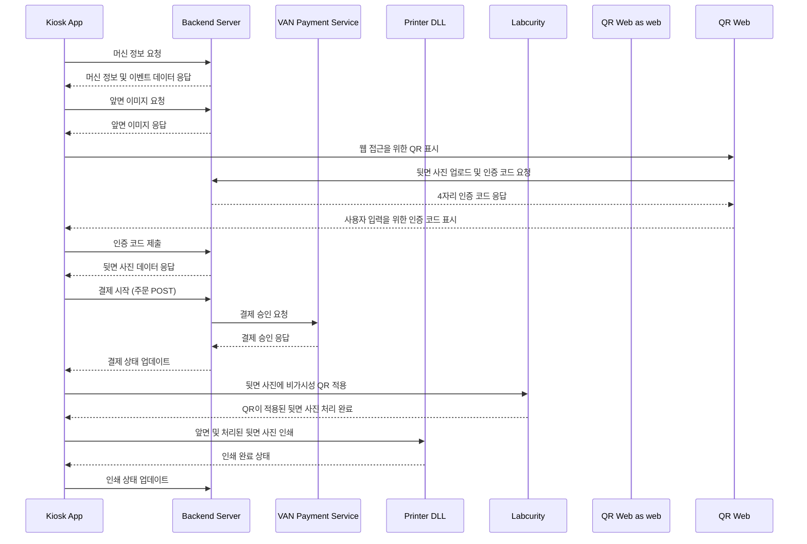
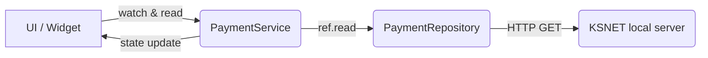

## 1. 프로젝트 개요

### 1.1 프로젝트(키오스크 역할) 소개

- **프로젝트 명**: `flutter_snaptag_kiosk`
- **플랫폼**: Windows (키오스크 전용)
- **키오스크 역할**
    - 웹(QR)과 연동하여 **백포토(카드 뒷면)** 이미지를 설정한 뒤 결제 & 인쇄를 진행
    - **비가시성 QR**(Labcurity) 삽입 기능
    - 결제(VAN사: **KSNET**) 및 인쇄(Luca DLL) 제공
- **문서 목적**
    - 키오스크 앱(**flutter_snaptag_kiosk**)의 개발 및 유지보수에 필요한 인수인계 문서

### 1.2 비즈니스 구조

- **키오스크**: 이벤트/포토카드 인쇄용 사용자 인터페이스
- **QR 웹**: 뒷면 사진(백포토) 설정 및 인증번호 발급
- **서버**: 이벤트 데이터, 결제 상태, 인쇄 상태 관리
- **VAN사(KSNET)**: 결제 승인/취소
- **프린터(Luca DLL)**: 실물 카드 인쇄
- **Labcurity(labguard DLL)**: 카드 뒷면 이미지에 비가시성 QR 삽입

### 1.3 기술 스택

- **Flutter / Dart** (3.x / 2.17+)
- **상태관리**: Riverpod
- **네트워크**: `dio`, `http`, `retrofit`
- **이미지 처리**: `image` 라이브러리 + **Labcurity** DLL
- **프린터 연동**: Luca DLL
- **결제 연동**: KSNET (HTTP `EUC-KR` 인코딩 처리)
- **Slack Webhook**: 실시간 로그/오류 전송 (HTTP)

### 1.4 주요 기능 및 시스템 개요

1. **머신 ID 입력 & 이벤트 데이터 로드**
2. **QR 웹** 연동 (뒷면 이미지 설정 & 인증번호 발급)
3. **인증번호 입력** → 서버 검증 & 뒷면 사진 수신
4. **결제**(KSNET) & 주문 상태 업데이트
5. **인쇄**(비가시성 QR 삽입 → 프린터 DLL) & 인쇄 상태 업데이트
6. **Slack Webhook**(실시간 모니터링)

### 1.5 프로젝트 구조(스트럭처) 및 진행 배경

#### 레거시와 As-Is 비교

- **레거시(개선 전)**
    - GetX + `setState` 혼용, 전역 상태 불안정
    - 로깅: 로컬 txt 파일, 외부에서 로그 확인 어려움
    - 디렉터리 구조 혼재
    - dartcoding-convention을 지키지 않음
        - `ex) PascalCase의 프로젝트 및 파일명`

#### To-Be 방향성 및 필요성

- **클린 아키텍처 + Riverpod**로 전면 재구성
- **Slack Webhook** 통한 실시간 장애 모니터링
- DLL 모듈(프린터/Labcurity) 재정비 및 코드 구조 단순화
- API 기반 설정 관리로 실시간 수정 가능
## 2. 시스템 아키텍처

### 2.1 아키텍처 개요

- 키오스크 → 서버(주요 비즈니스 로직: 이벤트/결제/인쇄 상태)
- 키오스크 → VAN(KSNET) 결제
- Labcurity DLL(비가시성 QR), Luca DLL(프린터) 연동

### 2.2 네트워크 및 API 플로우

1. **머신 ID**로 서버에 이벤트 정보 로드
2. **QR 웹**에서 뒷면 설정 → **인증번호** 발급
3. **키오스크**에서 인증번호 입력 → 서버 검증 및 뒷면 데이터 응답
4. **결제**: VAN(KSNET) → 서버 결제 상태 업데이트
5. **인쇄**: Labcurity(비가시성 QR) + 프린터 DLL → 인쇄 결과 서버 업데이트

> [참고] 시퀀스 다이어그램



### 2.3 앱 구조

(추가 예정)

### 2.4 앱 폴더 구조

```
(추가 예정)
```

### 2.5 데이터 흐름 및 Riverpod

프로젝트에서는 [**Riverpod**](https://riverpod.dev) 상태관리를 통해 **UI <-> 비즈니스 로직 <-> 리포지토리/서드파티** 간의 데이터 흐름을 일관되게 관리하고 있습니다. 결제, 인쇄, Labcurity DLL 연동 각각에서 Provider가 핵심적인 역할을 합니다.

1. **사용자 액션** → (버튼 클릭, QR 스캔, 인증번호 입력 등)
2. **Provider Notifier**를 통해 비즈니스 로직 호출
    - 예: `ref.read(paymentServiceProvider.notifier).processPayment()`
3. **Repository**가 **API 클라이언트**를 호출해 서버나 DLL 등 외부와 통신
    - 예: 결제(`PaymentRepository.approve`) → `PaymentApiClient.requestPayment` → KSNET → 응답
    - 예: 프린트(`PrinterService.printImage`) → Luca DLL → 인쇄
4. **응답**(성공/실패)을 받아 내부 상태(Provider)를 업데이트
    - 예: `ref.read(paymentResponseStateProvider.notifier).update(response)`
5. **UI**가 Provider의 상태 변화를 구독(`watch`)하면서 자동으로 리빌드
    - 예: 환불 성공 시 “환불 완료” 메시지 노출, 인쇄 에러 발생 시 “인쇄 실패” 안내 후 `refund()` 호출

아래 흐름도는 예시로 **결제→인쇄→환불**로 이어지는 프로세스를 Riverpod이 어떻게 연결해 주는지를 나타냅니다.

```
[사용자 UI (Widget)]
      ↓   (버튼 클릭, etc.)
[PaymentService Provider] ----> [PaymentRepository] ----> [KSNET 모듈]
      ↓       (상태 업데이트)
[PrinterService Provider] ----> [Luca DLL]
      ↓
(인쇄 실패 시 refund)
[PaymentService.refund()]
   ...
```
#### 2.5.1 Provider 의존관계

- 예:
  - `PaymentService` → 내부에서 `paymentRepositoryProvider`를 참조
  - `PaymentRepository` → 내부에서 `PaymentApiClient`를 직접 사용
  - UI(Widget) → `ConsumerWidget` 또는 `ref.watch(...)`로 Provider 상태 읽기



#### 2.5.2 Riverpod 주요 사용 패턴

1. **`@riverpod` 데코레이터 + Generator**

    - `@Riverpod` 또는 `@riverpod`를 사용하면, build_runner가 `.g.dart` 파일을 생성
    - 예:
      ```dart
      @riverpod
      PaymentService paymentService(PaymentServiceRef ref) {
         return PaymentService(ref.read(paymentRepositoryProvider));
      }
      ```
    - 내부에서는 `ref.read(...)`나 `ref.watch(...)`로 다른 Provider를 사용할 수 있음

2. **`Notifier` or `AsyncNotifier`로 상태를 관리**

    - 예:
      ```dart
      @riverpod
      class PaymentService extends _$PaymentService {
         @override
         FutureOr<void> build() => null;

         Future<void> processPayment() async {
            state = const AsyncValue.loading();
            try {
              // ... 로직
              state = const AsyncValue.data(null);
            } catch(e,st) {
              state = AsyncValue.error(e, st);
            }
         }
      }
      ```

3. **UI에서 `ref.watch(...)`**

    - 예:
      ```dart
      final paymentState = ref.watch(paymentServiceProvider);
      if (paymentState.isLoading) {
         // 로딩 UI
     if (paymentState.isLoading) {
       // 로딩 UI
     } else if (paymentState.hasError) {
       // 에러 UI
     } else {
       // 정상 UI
     }
     ```

4. **오류 처리 & Retry**

   - 비즈니스 로직(`processPayment`)에서 예외 발생 시 → `AsyncValue.error`
   - UI에서 잡아서 재시도 버튼 등을 제공할 수도 있음

5. **호출 체인 예**

   - UI(Button) → `paymentService.processPayment()` →\
     `PaymentRepository.approve(...)` →\
     `PaymentApiClient.requestPayment(...)` → KSNET로 요청 → 응답 →\
     `PaymentRepository`가 `PaymentResponse` 반환 →\
     `paymentService`가 `state = AsyncValue.data(...)`로 업데이트 →\
     UI가 자동 리빌드되어 결제 결과 반영

---

### 2.5.3 데이터 흐름 예시 (결제 → 인쇄)

1. **사용자**가 “결제” 버튼 클릭
2. **`paymentService.processPayment()`** 호출
   - **`_createOrder()`** → 서버에 주문 생성
   - **결제 승인** (`paymentRepository.approve`) → KSNET 요청/응답
   - **주문 상태 업데이트** (승인 성공이면 `completed`, 실패면 `failed`)
   - StateProvider(`paymentResponseStateProvider`)에 결과 저장
3. **UI**에서 `ref.watch(paymentResponseStateProvider)`가 변해서 **“결제 성공”** 표시
4. 이어서 자동 혹은 수동으로 **인쇄 로직** → `printerService.printImage(frontFile, embeddedFile)` → Luca DLL 호출
5. 인쇄 실패 시 → `paymentService.refund()` 호출해 환불 처리


### **2.6 클린 아키텍처 & UseCase 구조 (추가)**

> 본 프로젝트는 **클린 아키텍처** 원칙을 적용하여 **도메인, 데이터, 프레젠테이션** 레이어를 구분하고,
> 핵심 로직(결제/인쇄)은 **UseCase** 형태로 분리하여 재사용성과 테스트 용이성을 높였습니다.

#### 2.6.1 전체 레이어 구성

```
domain/
 ├── entities/       # 기본 Entity (OrderEntity, BackPhotoForPrint 등)
 ├── repositories/   # 도메인 레포지토리 인터페이스 (필요 시)
 └── usecases/       # PaymentUseCase, PrintUseCase 등 핵심 시나리오

data/
 ├── datasources/    # remote/local/cache 등
 ├── models/         # DTO, API응답 등
 ├── repositories/   # kioskRepository, paymentRepository (구현체)
 └── ...

features/ or presentation/
 ├── providers/      # Riverpod Notifier
 ├── screens/        # UI
 ├── service/        # LabcurityService, PaymentService, PrintService
 └── widgets/        # 재사용 위젯
```

- **domain**: 순수 비즈니스 규칙(UseCase, Entity)을 담는 레이어
- **data**: API 호출, DB/Cache, DTO/Model, Repository 구현
- **presentation**(or features):
  - UI(스크린/위젯)
  - 상태관리(Riverpod Provider)
  - Service (UseCase 호출 or Infra 호출 등 오케스트레이션)

#### 2.6.2 UseCase의 역할

- `PaymentUseCase`: “결제 시나리오”를 전담
  - 주문 생성 → 결제 승인 → 서버에 상태 업데이트
  - 환불 시나리오(취소 API)도 처리
- `PrintUseCase`: “인쇄 시나리오”를 전담
  - Labcurity(비가시성 QR) 삽입 → 프린트 DLL 호출 → 서버에 인쇄 상태 업데이트

#### 2.6.3 Service와 UseCase 관계

- **Service** (`PaymentService`, `PrintService` 등)는 현재 UI(Provider)에서 호출되어,
  - UseCase를 **호출**하는 “경량 Wrapper” 역할을 합니다.
  - 예: `PaymentService.processPayment() → paymentUseCase.processPayment()`
- **UseCase**는 **Domain**에 위치하며,
  - `kioskRepositoryProvider`, `paymentRepositoryProvider` 등 Data 레이어를 참조하여 핵심 로직 수행
  - Service나 UI와는 직접 의존하지 않음(역방향 의존 배제)

#### 2.6.4 사용 예시

1. **사용자가 “결제” 버튼 클릭**
   - UI → `PaymentService.processPayment()`
   - 내부 → `PaymentUseCase.processPayment()`
   - → (주문 생성 + KSNET 결제 + 주문 상태 갱신)
   - → 결과(`PaymentResponse`, `UpdateOrderResponse`) 반환
2. **사용자가 “인쇄” 버튼 클릭**
   - UI → `PrintService.print()`
   - 내부 → `PrintUseCase.doPrint()`
   - → (Labcurity 임베딩 + printStatus 생성 + 프린터 DLL 호출 + printStatus 완료)
3. **Service**에서는 로딩 상태/ Provider state 갱신 등 “애플리케이션 레벨” 처리를 수행
4. **UseCase**는 오직 “도메인 로직”에만 집중

### 3.1 공통 모듈

- **로깅 시스템(Slack Webhook)**
    - `.env`의 `SLACK_WEBHOOK_URL` 활용
    - 예외/에러 발생 시 실시간 Slack 전송
- **결제 모듈(KSNET)**
    - `http` 패키지(`EUC-KR` 인코딩)
    - 승인 성공 시 서버에 상태 업데이트
    - KSNET 관련 API 호출 시 Slack 전송
    - 오류 시 다이얼로그 UI로 사용자 안내
- **프린터(Luca DLL)**
    - 카드 인쇄
    - 인쇄 상태에 따라 서버에 상태 업데이트
    - 오류 시 다이얼로그 UI로 사용자 안내
- **비가시성 QR(Labcurity)**
    - 백포토 이미지에 QR 삽입

### 3.2 프린터(Luca DLL) 상세 구현

아래는 본 프로젝트에서 **Luca DLL**을 통한 카드 인쇄를 어떻게 구현했는지 간략히 정리한 내용입니다.

#### 3.2.1 FFI 바인딩 구조

`lib/features/core/printer` 디렉터리에 관련 파일들이 위치하며, Dart의 `dart:ffi`를 이용해 Luca DLL의 함수를 호출합니다:

- `printer_bindings.dart`:
    - DLL을 로드한 뒤, 각 함수 포인터를 Dart 함수로 매핑합니다.
    - 예: `_dll.lookupFunction<R600LibInitNative, R600LibInit>('R600LibInit')`
    - 함수 typedef는 `printer_bindings.typedef.dart`에 정의되어 있습니다.
- `printer_service.dart`:
    - Riverpod Provider(`PrinterService`)를 통해 프린터 로직을 캡슐화합니다.
    - `printImage()` 같은 고수준 메서드를 제공해, 실제 UI·비즈니스 로직에서 쉽게 호출할 수 있도록 구성합니다.
    - 내부적으로 **캔버스 준비 → 이미지 그리기 → 카드 투입 → 인쇄 → 배출** 과정을 순서대로 진행합니다.
- `printer_status.dart`:
    - 프린터 상태(온도, 에러 코드 등)를 담는 모델 클래스입니다.

#### 3.2.2 동작 흐름

1. **라이브러리 초기화** (`_bindings.clearLibrary()`, `connectPrinter()`)
     - USB 프린터를 열거(`_enumUsbPrt`)하고, 타임아웃 설정(`_usbSetTimeout`), 프린터 선택(`_selectPrinter`)을 수행합니다.
     - `initLibrary()`로 DLL 쪽 초기화 코드를 호출할 수도 있습니다.
2. **프린터 준비상태 확인** (`_bindings.ensurePrinterReady()`)
     - 이미 카드가 들어있으면 배출.
     - 피더에 카드가 있는지 확인.
3. **캔버스 준비** (`prepareCanvas`)
     - 색상(컬러/흑백) 모드를 설정하고, 도면 위에 이미지나 텍스트를 그릴 준비를 합니다.
4. **이미지 그리기** (`drawImage`)
     - 배경, 사진, 워터마크 등을 좌표(x,y)와 크기(width,height)에 맞춰 그립니다.
     - 필요 시 `drawText`로 글씨도 추가할 수 있습니다.
5. **캔버스 확정** (`commitCanvas`)
     - 그려진 캔버스 내용을 내부적으로 문자열(ImgInfo) 형태로 반환받아, 차후 인쇄 시 사용할 수 있도록 합니다.
6. **카드 투입** (`injectCard`)
     - 프린터 내부로 카드를 가져옵니다.
7. **인쇄 실행** (`printCard`)
     - 앞면(Front) 이미지 정보와 뒷면(Back) 이미지 정보를 인자로 넘겨 인쇄.
8. **카드 배출** (`ejectCard`)
     - 인쇄 완료 후 카드를 배출.

#### 3.2.3 주요 함수 소개

- `connectPrinter`:
    - DLL 초기화(`_libInit`) → USB 프린터 열거(`_enumUsbPrt`) → 타임아웃 설정(`_usbSetTimeout`) → 프린터 선택(`_selectPrinter`)을 순서대로 수행.
    - 성공 시 `true` 반환, 실패 시 `false`.
- `prepareCanvas`:
    - 캔버스를 컬러 또는 흑백 모드로 준비.
    - 실패 시 예외(throw) 발생.
- `drawImage`:
    - 지정한 경로의 이미지 파일을 카드 도면에 그립니다.
    - `noAbsoluteBlack` 파라미터(0/1)에 따라 흑색 농도를 제어.
- `printCard`:
    - 앞·뒷면 인쇄 정보를 넘겨줘 한 번에 출력.
    - 내부적으로 프린터 DLL의 `R600PrintDraw`를 호출.
- `ensurePrinterReady`, `injectCard`:
    - 카드가 프린터 안에 있는지, 피더가 비어있지 않은지 등을 확인.
- `getPrinterStatus`:
    - 온도(샤시/헤드/히터), 에러 상태 등을 담은 `PrinterStatus` 객체를 반환.
    - 에러 코드가 0이 아니면 장애 상태로 판단.

#### 3.2.4 에러 처리 및 로그

- 대부분의 DLL 함수들은 성공 시 0을, 실패 시 0이 아닌 에러 코드를 반환.
- 에러 코드 조회 시 `getErrorInfo(errorCode)`로 설명 문자열을 가져와 **Slack 로그** 혹은 예외 메시지로 활용.
- 인쇄 과정에서 실패하면 즉시 `throw Exception(...)`으로 에러를 발생시켜 상위 로직(UI)에서 예외 처리.

#### 3.2.5 이미지 회전/가공

- `rotateImage`:
    - 뒤집힌(180도 회전) 이미지를 다시 회전해 올바르게 인쇄.
    - `package:image/image.dart` 라이브러리를 사용.

#### 3.2.6 주의사항

1. **파일 경로**: DLL 함수에 넘길 이미지 경로는 실제 파일 시스템 경로여야 하며, 존재하지 않을 경우 에러.
2. **캔버스 커밋(`commitCanvas`) 필수**: 캔버스에 그린 뒤, `commitCanvas`를 호출해 얻는 문자열을 인쇄함수 `printCard`에 인자로 넘깁니다.
3. **USB 연결/드라이버**: 실제 Windows 환경에서 Luca 프린터 드라이버가 설치되어 있어야 하며, USB가 인식되는지 사전에 확인.
4. **디버그**: 초기에 `_bindings.connectPrinter()` 등에서 실패 시, 로그(`logger.i`)를 확인하여 에러 코드를 파악.
5. **카드 배출**: 인쇄 성공/실패 여부와 상관없이, 카드가 프린터 안에 남아있으면 재시도 시 충돌이 날 수 있으므로 주의.
### 3.3 Labcurity(비가시성 QR) 상세 구현

본 프로젝트에서는 Labcurity DLL을 통해 카드 뒷면에 ‘비가시성 QR’을 삽입합니다. 코드는 `lib/features/core/labcurity` 디렉터리에 위치해 있으며, 크게 아래 세 파일로 구성됩니다:

- **labcurity_bindings.dart**
    - Labcurity DLL에 정의된 함수를 FFI로 바인딩 (getLabCodeImageFullW)
- **labcurity_library.dart**
    - DynamicLibrary를 로드하고, binding 함수를 호출하는 ‘랩퍼(Wrapping)’ 역할
- **labcurity_service.dart**
    - 상위 레벨의 ‘이미지 변환’ 로직을 캡슐화해 Riverpod Provider로 노출
    - 호출자는 `labcurityService.embedImage(...)` 형태로 사용

#### 3.3.1 FFI 바인딩 구조

Labcurity DLL 함수 getLabCodeImageFullW 를 Dart에서 호출할 수 있도록, dart:ffi 를 활용해 아래처럼 구현합니다:
- labcurity_bindings.dart 에서 C 함수 시그니처를 typedef로 정의

```dart
typedef GetLabCodeImageFullWNative = Int32 Function(...);
typedef GetLabCodeImageFullWDart = int Function(...);
```

- labcurity_library.dart 에서 DLL 로드 후 함수 포인터를 찾아와 Dart 함수로 매핑

```dart
_dll = DynamicLibrary.open(dllSource);
_getLabCodeImageFullW = _dll.lookupFunction<GetLabCodeImageFullWNative, GetLabCodeImageFullWDart>("getLabCodeImageFullW");
```

#### 3.3.2 동작 흐름

1. **이미지 준비**
     - `Uint8List` 형태의 원본 이미지(뒷면 사진 등)를 입력받음
     - 임시 폴더(예: `assets/input`)에 파일로 저장
2. **Labcurity DLL 호출**
     - `labcurityLibrary.getLabCodeImageFullW(...)` 호출 시, *keyPath* (라이선스/키파일), *inputPath*, *outputPath* 등을 인자로 전달
     - 성공 시 **0** 반환, 실패 시 0이 아닌 에러 코드 반환
3. **결과 이미지 확인**
     - DLL이 생성한 출력 파일(outputPath)을 `File` 객체로 다시 읽어옴
     - 이 파일에 ‘비가시성 QR’이 삽입되어 있으므로, 일반 뷰어로는 보이지 않지만, Labcurity 전용 리더/장치에서 스캔 가능
4. **정리**
     - 입력 파일 등 임시 파일 삭제

#### 3.3.3 주요 메서드

- `embedImage(Uint8List imageBytes, [LabcurityImageConfig? config])`
    - 호출 예:
        ```dart
        final labcurityFile = await labcurityService.embedImage(originalBytes);
        ```
    - 내부에서:
        1) 원본 이미지를 임시 폴더에 저장
        2) Labcurity DLL(`getLabCodeImageFullW`)을 호출
        3) 성공 시 결과 파일을 반환
        4) 입력 파일 삭제
    - `LabcurityImageConfig`로 QR 사이즈, 강도(strength), alpha/bravoCode 등의 파라미터 지정 가능

- `getLabCodeImageFullW(...)` (FFI 함수)
    - keyPath, inputPath, writePath, size, strength 등 다양한 파라미터를 받음
    - QR 삽입 동작을 수행하고 성공/실패 코드 반환

#### 3.3.4 파라미터 설명

| 파라미터     | 설명                                  |
|--------------|---------------------------------------|
| **size**     | QR 크기 (기본값: 1)                  |
| **strength** | QR 농도 또는 강도 (기본값: 1)        |
| alphaCode    | 추가 조정값 (0~?)                   |
| bravoCode    | 추가 조정값 (0~?)                   |
| ...          | (DLL 문서 참고)                      |

각 파라미터 범위나 역할은 **Labcurity DLL 매뉴얼**을 참고하여 설정합니다.

#### 3.3.5 주의사항

1. **DLL & keyPath**
     - Windows 환경에서 DLL 파일(`labcurity.dll`)과 라이선스/키 파일이 올바른 경로에 존재해야 합니다.
     - `FilePaths.labcurityDLL.buildPath`와 `FilePaths.labcurityKey.buildPath`가 유효해야 정상 동작.
2. **이미지 포맷**
     - 현재 예제에서는 PNG/JPG/GIF/BMP만 지원 (magic number 검사).
     - `unsupported format` 에러 시 개발자가 확장.
3. **성능**
     - 실제 이미지 처리는 DLL에서 수행
     - 이미지 크기에 따라 처리 시간이 소요될 수 있으므로, 필요 시 별도의 Isolate나 비동기 처리 고려.
4. **오류 처리**
     - DLL 함수 반환값이 0이 아니면 실패로 간주, `throw Exception('Failed to process image. Error code: $result')`
     - Slack 로깅 등으로 오류 내용을 공유할 수 있음.
5. **생성된 ‘비가시성 QR’ 확인**
     - 일반 뷰어에는 보이지 않음
     - 전용 리더기(또는 Labcurity의 테스트 툴)로 스캔해 진짜 삽입되었는지 확인.
### 3.4 결제(KSNET) 상세 구현

아래는 키오스크 결제 로직의 구현 상세로, **KSNET**을 통해 카드 결제를 승인/취소(환불)하는 과정을 다룹니다.

프로젝트 구조상 결제 관련 코드는 주로 다음과 같은 위치에 있습니다:

- **`lib/data/datasources/remote/payment_api_client.dart`**: KSNET에 요청을 전송하고 응답을 수신
- **`lib/data/repositories/payment_repository.dart`**: 결제/환불 요청을 추상화, API 클라이언트를 호출해 응답을 반환
- **`lib/features/presentation/services/payment_service.dart`**: 결제 프로세스(주문 생성→결제→주문 상태 업데이트) 및 환불 로직
- **기타**: 환불 절차를 실행하는 `setup_refund_process_provider.dart` 등

#### 3.4.1 PaymentApiClient

- **이용 방식**: HTTP GET 요청으로 KSNET 모듈(로컬 서버)과 통신
    - 예: `GET http://127.0.0.1:27098?callback=xxx&REQ=yyy`
    - `callback` 파라미터: 응답 JSON 앞뒤에 래핑된 콜백 함수를 제거하기 위해 사용
    - 응답 예시: `xxx({"respCode":"0000","approvalNo":"123456"})`
- **문자 인코딩**: `charset=euc-kr`로 요청, **cp949**(혹은 EUC-KR) 디코딩 과정 필요
    - 응답 본문에 콜백이 포함되어 있어, 이를 제거한 뒤 cp949로 디코딩하여 JSON 파싱
- **`requestPayment`** 메서드:
    - `callback`(머신 ID 등) + `request`(결제 요청 필드)를 조합하여 쿼리스트링을 구성
    - 응답을 받아 **cp949**로 디코딩 → JSON 객체로 파싱 → `PaymentResponse`로 변환
- **에러 처리**:
    - HTTP 요청 실패 시 예외 발생
    - Slack 등에 로그를 남기거나, UI 레벨에서 에러 메시지를 띄움

#### 3.4.2 PaymentRepository

- **`approve`** (결제 승인) & **`cancel`** (환불/취소)
    - 각 메서드에서 **`Invoice.calculate`** 를 통해 세금/공급가액 등을 산출
    - `PaymentRequest.approval(...)` 또는 `.cancel(...)` 형태로 요청 객체를 생성
    - `_request(...)` 메서드에서 **PaymentApiClient**를 호출해 실제 결제/취소 진행
- **오류 처리**:
    - `_request` 내부에서 발생한 예외는 상위로 rethrow
    - UI나 다른 로직에서 잡아서 환불 로직 등을 수행 가능

#### 3.4.3 PaymentService (결제 프로세스)

- **`processPayment()`**:
    1. **주문 생성** (`_createOrder()`)
    2. **결제 승인** → `paymentRepository.approve(...)`
    3. **주문 상태 업데이트** (`_updateOrder()`)
    4. 인쇄 등 후속 작업을 위해 결제 정보(`paymentResponseStateProvider`)를 보관

- **`refund()`**:
    1. **결제 정보**가 존재하는지 확인(승인번호 등)
    2. `paymentRepository.cancel(...)` 호출로 취소 처리
    3. **주문 상태**(예: refunded)로 업데이트

- 결제/환불 중 예외가 발생하면 상위에서 캐치해 UI에 오류 표시 + 재시도/로그 전송

#### 3.4.4 결제 흐름 요약

1. 사용자가 **결제 버튼**을 누르면
        - `PaymentService.processPayment()` → (주문 생성) → (KSNET 승인 요청) → (주문 업데이트)
2. 승인 성공 시 → **인쇄** 작업 진행
3. 인쇄 실패 등 문제가 생기면 → **`refund()`**로 환불 처리

#### 3.4.5 부분/전체 환불

- 현재 예제 코드는 전체 금액을 통째로 취소(=전액 환불)하는 방식
- **`cancel`** 호출 시, 원 승인번호(`originalApprovalNo`)와 승인일자(YYMMDD 형식)를 사용
- 부분 환불이 필요한 경우, KSNET 측 사양에 따라 별도 파라미터 처리 필요(본 예제 코드에는 미구현)

#### 3.4.6 주의사항

1. **EUC-KR 인코딩**
    - Windows/Kiosk 환경에서 KSNET 모듈이 EUC-KR을 사용하므로, 요청·응답을 모두 주의 깊게 처리
    - `Content-Type: application/json; charset=euc-kr`, cp949 디코딩 로직
2. **시간 동기화**
    - 승인일자(YYMMDD)로 취소를 진행하므로, Kiosk 시계가 실제 결제 시각과 달라지면 문제가 생길 수 있음
3. **오류 시 즉시 환불**
    - 인쇄 실패 등 에러 발생 시, 자동으로 `refund()`를 호출해 결제를 취소하는 로직이 포함됨
    - 이 로직이 의도된 것인지(사용자 의사 확인 없이 환불?), 혹은 예외 케이스를 구분해야 하는지 확인 필요
4. **Slack Webhook**
    - 결제 성공/실패 로그 등을 Slack으로 전송해 모니터링 가능
5. **테스트 위젯**: `PaymentTestWidget`
    - 금액, 승인번호, 승인일자 등을 입력해 **결제/환불** 시뮬레이션 가능
    - 실제 배포 환경에서는 제외 또는 관리자 페이지로 제한
6. **서버 상태 업데이트 실패 시 환불**
   - KSNET 결제 승인까지는 성공했으나, **서버에 주문 상태(PATCH) 업데이트**가 실패(네트워크 에러, 서버 5xx 등)할 수도 있음
   - 이 경우 거래가 “승인은 되었지만 주문 상태는 미완료”인 애매한 상태이므로, **즉시 환불** 로직을 수행하도록 설계
     - *사유:* 서버와 Kiosk 간 **데이터 일관성**을 맞추기 위해, “서버에 주문 완료로 기록되지 않은 거래”는 무효 처리 방안을 택했기 때문
   - 그 외 케이스(예: 서버 일시 오류 후 재시도 성공)는 상황에 따라 **UI에서 재시도**, **Slack 알림**, **관리자 확인** 등 추가 처리 고려 가능

### 3.5 보안(인증/인가, 데이터 보호 등)

- **`.env` 관리**: 중요 키(슬랙 URL 등)는 Git에 노출되지 않도록 주의
    - 릴리즈 노트 파일 `.env`에 키가 포함되지 않도록 주의해주세요.
    - 노출될 시 슬랙 측에서 즉시 폐기합니다.
- **결제 정보**:
    - order API 호출 시 detail로 전송
    - 결제 response 응답 시 슬랙으로 전송
    - KSNET 상세 결제 응답 로그는 각 로컬 기기 `~/`에 저장됩니다.
    - 이후 KSNET 상세 결제 응답 로그에 대해서 슬랙을 통해 자동 전송을 하는 기능 추가 고려
- 암호화 처리 없음. 추후 고려 필요
## 4. 개발 가이드

### 4.1 코드 스타일 가이드

- **Dart 공식 코딩 컨벤션** 준수(`flutter_lints`)
- **Freezed** + **JsonSerializable** 활용
- **모듈별**(features) 분리
- dart line length 120

### 4.2 패키지 구조 & 네이밍 컨벤션

- **`core`**: 공통 유틸(네트워크, 로깅 등)
- **`features/[기능명]`**: `machine`, `payment`, `print` 등
- **`ui`**: Screens, Widgets
- **Provider**: `@Riverpod`로 선언 → `.g.dart` 생성

### 4.3 의존성 관리

- `pubspec.yaml`에서 라이브러리 버전 지정
- **build_runner** (Freezed, Retrofit, Riverpod 생성)
    - `flutter pub run build_runner build --delete-conflicting-outputs`

### 4.4 버전 규칙

- **Semantic Versioning** (`vX.Y.Z+빌드번호`)
    - 서버 API 변경처럼 **호환성**이 달라지는 중요한 업데이트의 경우, **마이너 버전**(혹은 **메이저 버전**)을 올려 명확히 표시
    - 버그 픽스나 사소한 수정은 패치 버전(Z)만 증가시키는 방식 적용
- **예시**: `v2.0.0` → **마이너 업데이트**: `v2.1.0`, 이후 패치로 `v2.1.1`, `v2.1.2` 등

> (참고) 7.7 버전 관리 개선 가이드 에서 구체적 사례 설명

### 4.5 CI/CD 구성

- (현재 미적용)
- (TODO) GitHub Actions 도입 하여 main에 머지될 시 자동 tag 및 release note 생성

### 4.6 빌드 스크립트

아래 스크립트(`script.sh`)는 **CLI 메뉴**를 통해 빌드 러너/로컬라이제이션/Flutter 빌드 등을 빠르게 수행합니다.

> (참고)
- Windows PowerShell 환경에서 .sh 스크립트를 실행하려면 bash script.sh 형태로 실행하거나,
Set-ExecutionPolicy -ExecutionPolicy RemoteSigned -Scope CurrentUser 설정 후 .\script.sh 명령어로 실행해야 합니다.
- macOS/Linux 환경에서는 chmod +x script.sh 후 ./script.sh로 실행 가능합니다.

```bash
echo "Welcome to flutter utilities:"
echo
echo "[1] build runner"
echo "[2] build runner --delete-conflicting-outputs"
echo "[3] generate localization files"
echo "[4] flutter build windows --debug"
echo "[5] flutter build windows --release"
echo "[6] flutter create . --platforms windows"
read -p "Run: " selection

case $selection in
    1)
    echo "Running build_runner"
    dart run build_runner build
    ;;

    2)
    echo "Running build_runner with --delete-conflicting-outputs"
    dart run build_runner build --delete-conflicting-outputs
    ;;

    3)
    echo "Generating localization files"
    dart run easy_localization:generate -S assets/lang -O lib/localization -f keys -o locale_keys.g.dart
    ;;

    4)
    echo "Building Flutter for Windows in debug mode"
    flutter build windows --debug
    ;;

    5)
    echo "Building Flutter for Windows in release mode"
    flutter build windows --release
    ;;

    6)
    echo "Creating Flutter project for Windows platform"
    flutter create . --platforms windows
    ;;

    *)
    echo "Unknown command!!"
    ;;
esac

# Windows에서 스크립트 실행 방법
# PowerShell 명령어를 사용하여 스크립트에 실행 권한 부여
# Set-ExecutionPolicy -ExecutionPolicy RemoteSigned -Scope CurrentUser
# 스크립트 실행
#.\script.sh

# macOS에서 스크립트 실행 방법
# 터미널 명령어를 사용하여 스크립트에 실행 권한 부여
# chmod +x script.sh
# 스크립트 실행
# ./script.sh
```

---

### 4.6.1 스크립트 활용 시 주의사항

1. **Flutter/Dart 버전 호환**
    - 프로젝트가 **Flutter 3.X**를 요구한다면, 로컬 머신 Flutter 버전도 확인 필요
    - `flutter --version`, `dart --version`으로 호환성 체크
2. **실행 환경**
    - Windows:
        - PowerShell/WSL/Bash 환경 중 어디에서 실행하는지 명시
        - PowerShell 스크립트 실행 정책(ExecutionPolicy)에 유의
    - macOS/Linux:
        - `chmod +x script.sh` 후 `./script.sh`
        - 실행 권한 부여 필수
3. **패키지 의존성**
    - 스크립트를 실행하기 전 `flutter pub get` / `dart pub get`이 정상 완료되었는지 확인
    - build_runner 작업 시 **충돌**이 발생할 수 있으므로, `-delete-conflicting-outputs` 옵션을 유연하게 선택
4. **추가 작업**
    - **`flutter clean`** / **`flutter test`** / **커버리지 보고서** 생성 등을 메뉴에 추가할 수 있음
    - **로깅**: 빌드 과정에서 발생하는 로그를 파일로 저장해두면, CI/CD 파이프라인에서 참고 가능
    - **원격 빌드/CI 연동**
        - 로컬 개발자가 아닌, **CI/CD**(예: GitHub Actions)에서도 동일 스크립트를 사용할 수 있도록 구성 가능
        - CI 환경 변수(`CI=true` 등)에 따라 빌드 옵션 분기

---

### 4.6.2 스크립트 확장 예시

- **환경 변수/프로파일**: 배포 환경(dev, stage, prod)에 따라 다른 `.env` 파일을 복사하거나, 다른 빌드 옵션을 주고 싶을 때

    ```bash
    case $profile in
        dev) cp .env.dev .env ;;
        prod) cp .env.prod .env ;;
    esac
    ```

- **Sentry/SonarQube** 등 외부 툴 연동
    - 빌드 완료 후, 자동으로 **소스코드 품질 검사**나 **에러 모니터링** 설정 실행

> (예) flutter test --coverage && genhtml coverage/lcov.info -o coverage/html
### 4.7 로컬라이제이션(Localization) 관리

키오스크 앱은 [**easy_localization**](https://pub.dev/packages/easy_localization)을 사용하여 다국어(한국어, 영어, 일본어, 중국어 등)를 지원합니다. 이를 위해 다음과 같은 구조를 갖추고 있습니다:

```
assets/
 ├── fonts
 │   └── ...
 ├── icons
 │   └── ...
 ├── images
 │   ├── ...
 ├── labcurity
 │   └── ...
 ├── lang
 │   ├── en-US.json
 │   ├── ja-JP.json
 │   ├── kiosk_langs.tsv   <-- Google 스프레드시트에서 내보낸 tsv 파일
 │   ├── ko-KR.json
 │   └── zh-CN.json
 ├── luca
 │   └── ...
 └── sounds
    └── ...
```

#### 4.7.1 Google 스프레드시트 → .tsv 내보내기

1. **협업 번역 관리**
   - 구글 스프레드시트에서 각 언어별 번역 문구를 정리하고, 열(Column)마다 `ko`, `en`, `ja`, `zh` 등의 번역을 작성합니다.
   - 스프레드시트에 새 문구가 추가되거나 수정될 경우, 스프레드시트에서 **TSV(Tab-Separated Values) 형식**으로 내보내기를 수행합니다.

2. **`.tsv` 파일 반영**
   - 내보낸 `kiosk_langs.tsv` 파일을 `assets/lang` 폴더 아래에 저장(또는 교체)합니다.
   - 표 형식(`\t` 구분자)으로 번역을 한눈에 확인할 수 있으며, 실제 앱에서 사용할 `.json`과 `locale_keys.dart`를 생성하는 소스 파일이 됩니다.

#### 4.7.2 번역 JSON 및 `locale_keys.dart` 자동 생성

- **easy_localization**의 `generate` 스크립트를 통해, `.tsv` 데이터를 기반으로 각 언어별 `.json` 파일 및 `locale_keys.dart`가 자동 생성됩니다.
- 일반적인 실행 절차는 다음과 같습니다:

```bash
# 먼저, pubspec.yaml에 easy_localization 관련 설정을 확실히 해둡니다.

# 그런 다음, build_runner나 generate 명령을 실행하여
# .tsv를 참조한 뒤, 각 언어별 .json과 locale_keys.dart 파일을 생성할 수 있습니다.
# 아래와 유사한 명령어(프로젝트 설정에 따라 다를 수 있음)를 실행:

dart run easy_localization:generate \
    -S assets/lang \
    -O lib/localization \
    -f keys \
    -o locale_keys.dart
```

- 위 명령어를 실행하면, `assets/lang` 아래 존재하는 `.tsv`(또는 `.json`) 내용을 분석하여:
  1. **각 언어별 `.json` 파일**을 업데이트(또는 생성)
   2. 앱 내부에서 사용할 **`locale_keys.dart`**를 자동으로 생성

- 생성된 `locale_keys.dart`는 아래와 같은 형태로, **키(상수)**만 정의되고 실제 번역 텍스트는 `.json` 파일에 저장됩니다:

  ```dart
  // DO NOT EDIT. This is code generated via package:easy_localization/generate.dart

  abstract class LocaleKeys {
    static const main_txt_01_01 = 'main_txt_01_01';
    static const main_txt_01_02 = 'main_txt_01_02';
    ...
  }
  ```

  > **주의**: `locale_keys.dart`는 **자동 생성 파일**이므로, **직접 수정**하면 다시 덮어쓰여질 수 있습니다.
  > 문구 수정이 필요할 때는 **Google 스프레드시트**나 `.tsv`, 혹은 `.json`에 수정 사항을 반영한 뒤 다시 스크립트를 실행하세요.

#### 4.7.3 코드에서 번역 문자열 사용하기

- UI 코드(예: Flutter 위젯)에서 문구를 표시할 때, `LocaleKeys.xxx.tr()` 형태로 번역 문자열에 접근할 수 있습니다. 예:

  ```dart
  import 'package:easy_localization/easy_localization.dart';
  import 'package:my_app/localization/locale_keys.dart';

  Text(LocaleKeys.main_txt_01_01.tr())
  ```

- `LocaleKeys.main_txt_01_01`에 대응하는 실제 텍스트는, 현재 선택된 locale(ko-KR, en-US 등)에 맞춰 자동으로 `.json`에서 매핑되어 보여집니다.

#### 4.7.4 권장 워크플로우

1. **Google 스프레드시트**에서 다국어 문구를 일괄 관리, 수정.
2. **TSV 내보내기**로 `kiosk_langs.tsv` 생성 후, `assets/lang`에 저장.
3. **Localization 스크립트** 실행
   - `dart run easy_localization:generate ...`
   - → 언어별 `.json` + `locale_keys.dart` 생성/갱신
4. **Flutter 프로젝트** 빌드/실행
   - 변경된 번역 문구를 확인 후, 정상 동작 확인.

#### 4.7.5 주의 사항

- **`locale_keys.dart` 직접 수정 금지**: 스크립트 재실행 시 덮어쓰기됩니다.
- **`.json` 구조**: 각 언어별 `.json`은 JSON 키-값 쌍으로 작성되어 있어야 하며, 문법 오류(콤마 누락 등)에 주의합니다.
- **빌드 시점**: 번역 문구가 변경될 경우, **코드 리빌드**(또는 재실행) 전에 스크립트를 다시 실행해야 합니다.
- **문구 Key 충돌**: 스프레드시트에서 **동일 키**(예: `main_txt_01_01`)가 중복으로 존재하면, 마지막으로 읽힌 항목이 우선순위를 가집니다.
